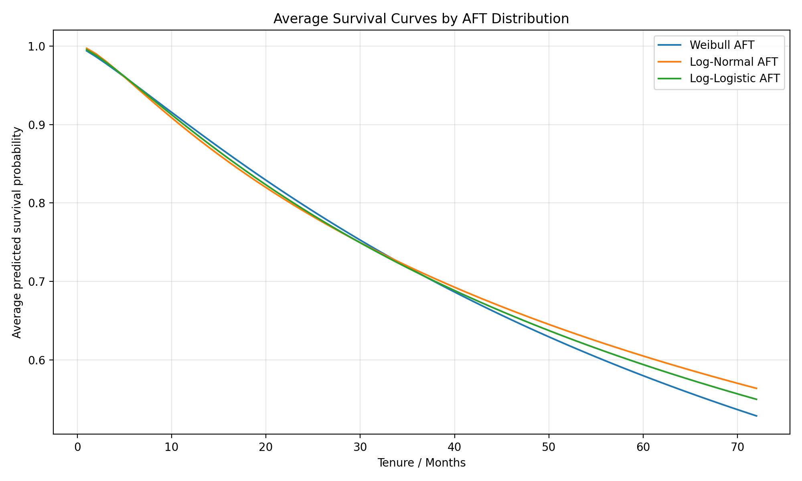
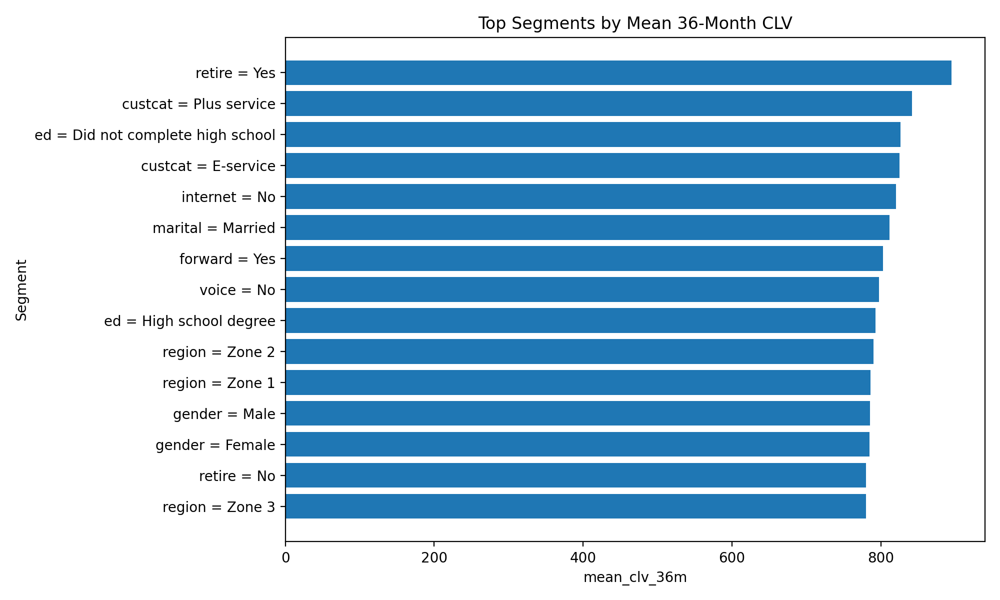
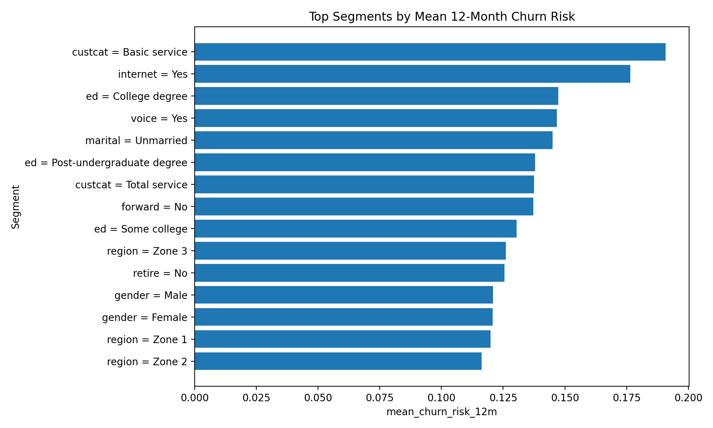

# Homework 3 Report: Survival Analysis and CLV

## Model comparison

The fitted AFT models were compared using log-likelihood, AIC, BIC, and concordance index. Lower AIC/BIC indicates better statistical fit after penalizing model complexity, while concordance measures ranking quality of predicted survival time.

| model                        |   n_parameters |   log_likelihood |     AIC |     BIC |   concordance_index | status             |
|:-----------------------------|---------------:|-----------------:|--------:|--------:|--------------------:|:-------------------|
| Log-Normal AFT               |             20 |         -1457.01 | 2954.02 | 3052.18 |            0.787216 | fit                |
| Log-Logistic AFT             |             20 |         -1458.1  | 2956.21 | 3054.36 |            0.787222 | fit                |
| Weibull AFT                  |             20 |         -1462.17 | 2964.34 | 3062.5  |            0.783818 | fit                |
| Generalized Gamma Regression |            nan |           nan    |  nan    |  nan    |          nan        | failed to converge |

> **Note on Generalized Gamma Regression:** This model was attempted as the most flexible parametric benchmark, but it did not converge reliably even with penalization. Because unstable convergence can make coefficients and predictions unreliable, I excluded it from final decision-making instead of forcing the model.

The selected decision model is **Log-Normal AFT**. It was selected because it had the lowest AIC and BIC among the converged models, The concordance index difference vs. the next-best alternative was negligible (< 0.0001), confirming the distributions perform equivalently on this data. For a decision-maker, interpretability and stability matter alongside statistical fit, which further supports choosing the simpler distribution when fit differences are negligible.

I focused on the standard AFT-style parametric regression models available in lifelines. Piecewise exponential regression was not included because it requires externally specified breakpoints rather than a single distributional AFT form, which makes it a different modeling approach rather than an additional AFT distribution.

## Significant features and interpretation

The statistically significant retained features are: address, age, custcat_E-service, custcat_Plus service, custcat_Total service, internet_Yes, marital_Unmarried, voice_Yes.

In an AFT model, a positive coefficient means the feature is associated with longer survival time, while a negative coefficient means shorter survival time and faster churn. The exponentiated coefficient is a time ratio: values above 1 increase expected survival time, and values below 1 reduce it.

| param   | covariate             |       coef |   time_ratio_exp_coef |           p | direction                             |
|:--------|:----------------------|-----------:|----------------------:|------------:|:--------------------------------------|
| mu_     | internet_Yes          | -0.840528  |              0.431483 | 1.20659e-09 | shorter survival / higher churn speed |
| mu_     | custcat_E-service     |  1.02582   |              2.7894   | 1.29275e-09 | longer survival / lower churn speed   |
| mu_     | age                   |  0.0368257 |              1.03751  | 8.69526e-09 | longer survival / lower churn speed   |
| mu_     | custcat_Plus service  |  0.822553  |              2.2763   | 1.20411e-06 | longer survival / lower churn speed   |
| mu_     | address               |  0.0428239 |              1.04375  | 1.29648e-06 | longer survival / lower churn speed   |
| mu_     | custcat_Total service |  1.01327   |              2.75459  | 1.33292e-06 | longer survival / lower churn speed   |
| mu_     | marital_Unmarried     | -0.447317  |              0.639341 | 9.31966e-05 | shorter survival / higher churn speed |
| mu_     | voice_Yes             | -0.463493  |              0.629082 | 0.00544895  | shorter survival / higher churn speed |

**Coefficient notes:**
- **custcat (E-service, Plus service, Total service):** All three service tiers show substantially longer survival vs. the Basic service baseline. This is the strongest driver of retention — customers on richer plans stay longer.
- **internet_Yes:** Negative coefficient (time ratio ≈ 0.43). Internet subscribers churn faster. This may reflect that internet-only or internet-primary subscribers have more competitive alternatives (broadband market) and lower switching costs than multi-service bundles.
- **voice_Yes:** Also negative (time ratio ≈ 0.63). Counterintuitively, voice service is associated with faster churn. This may reflect plan structure, customer type, or lower switching costs among voice-service users. I interpret this as an association, not a causal effect.
- **marital_Unmarried:** Unmarried subscribers churn faster. More mobile lifestyle and fewer household-level switching costs.
- **age and address:** Both positive. Older subscribers and those with longer residential stability churn more slowly — consistent with lower mobility and higher inertia.

## CLV and valuable segments

Customer-level CLV was calculated using the final survival model. I used a 36-month horizon, a monthly margin of $30.00, and an annual discount rate of 10%. Since the dataset does not contain actual telecom revenue or margin, I did not use subscriber income as revenue. Income describes the customer, not the company's margin from that customer. Therefore, value is defined as predicted discounted future margin, driven by survival probability.

The most valuable segments are defined as groups with high average 36-month CLV and enough customers to be commercially meaningful. The top segments are:

| segment                           |   n_customers |   mean_clv_36m |   mean_churn_risk_12m |   at_risk_customers |
|:----------------------------------|--------------:|---------------:|----------------------:|--------------------:|
| retire = Yes                      |            47 |        895.168 |             0.0253133 |                   0 |
| custcat = Plus service            |           281 |        841.624 |             0.0693792 |                  30 |
| ed = Did not complete high school |           204 |        826.321 |             0.0837695 |                  34 |
| custcat = E-service               |           217 |        825.252 |             0.0835071 |                  36 |
| internet = No                     |           632 |        820.31  |             0.0883729 |                 122 |

The riskiest segments by predicted 12-month churn risk are:

| segment                 |   n_customers |   mean_clv_36m |   mean_churn_risk_12m |   at_risk_customers |
|:------------------------|--------------:|---------------:|----------------------:|--------------------:|
| custcat = Basic service |           266 |        711.119 |              0.190783 |                 152 |
| internet = Yes          |           368 |        725.251 |              0.176524 |                 183 |
| ed = College degree     |           234 |        756.014 |              0.147382 |                  92 |
| voice = Yes             |           304 |        756.854 |              0.1468   |                 119 |
| marital = Unmarried     |           505 |        759.473 |              0.145059 |                 211 |

## Annual retention budget

I define an at-risk subscriber as a customer whose predicted probability of churn within the next 12 months is at least 15%. Under this rule, there are **305** at-risk subscribers out of **1,000**, or **30.5%** of the base.

The estimated CLV exposed to churn risk is **$46,004.04**. I would not spend the full amount, because not every retention contact will succeed and incentives have costs. A conservative annual retention budget is **25%** of expected CLV at risk, equal to **$11,501.01**.

Beyond budget allocation, I would suggest targeted retention rather than blanket discounts. High-CLV and high-risk subscribers should receive stronger offers or proactive service recovery, while low-risk customers should not receive expensive incentives. For segments with high churn risk but low CLV, cheaper interventions such as service education, plan reminders, or digital nudges are more defensible than monetary discounts.
